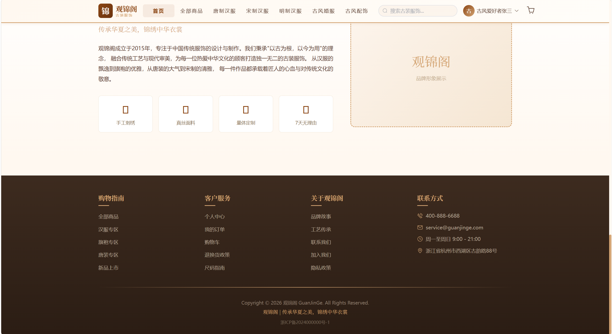
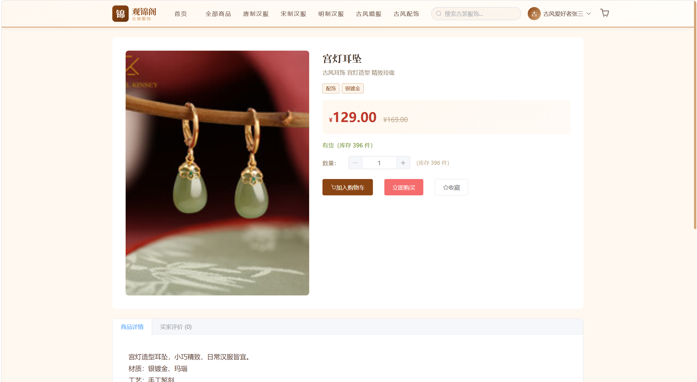
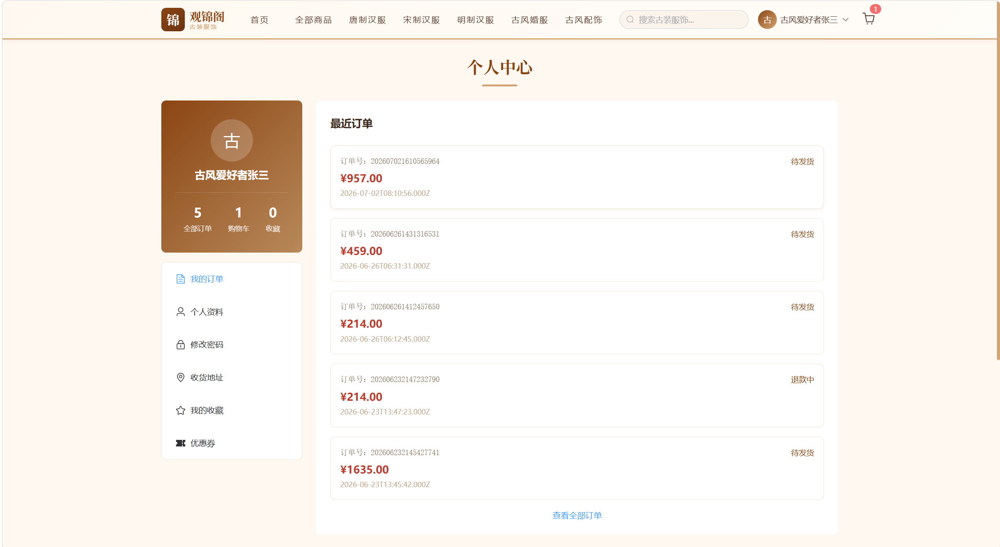
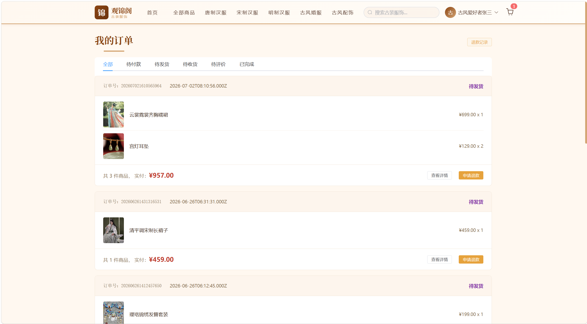
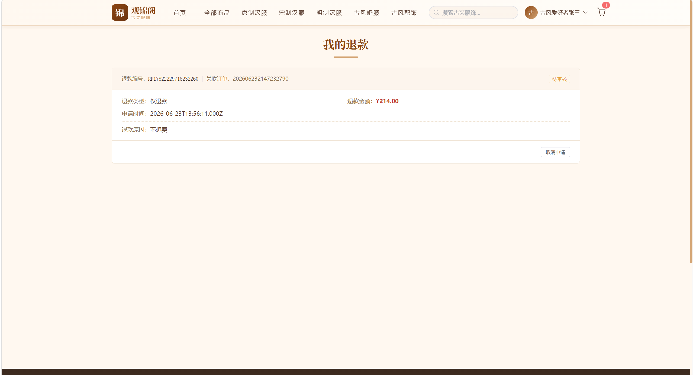
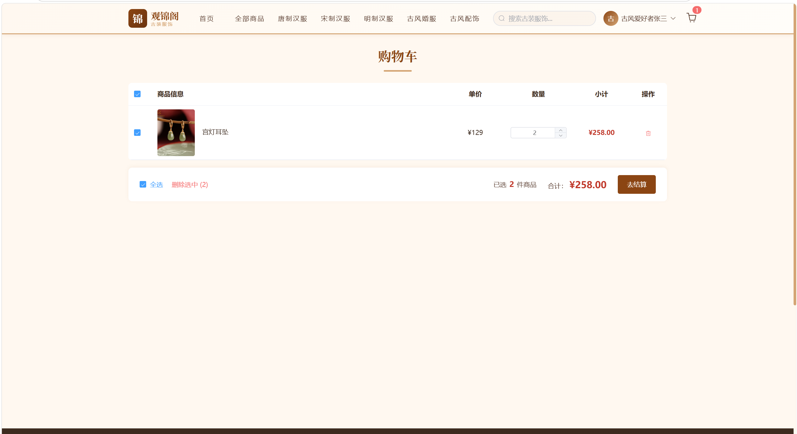
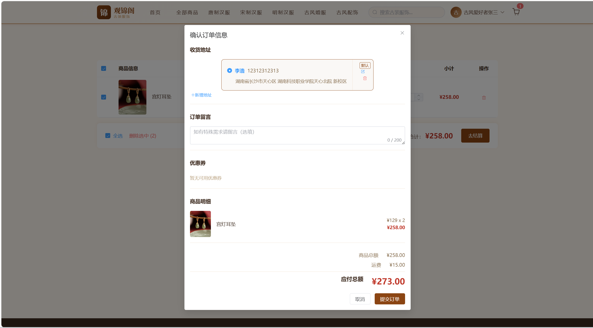
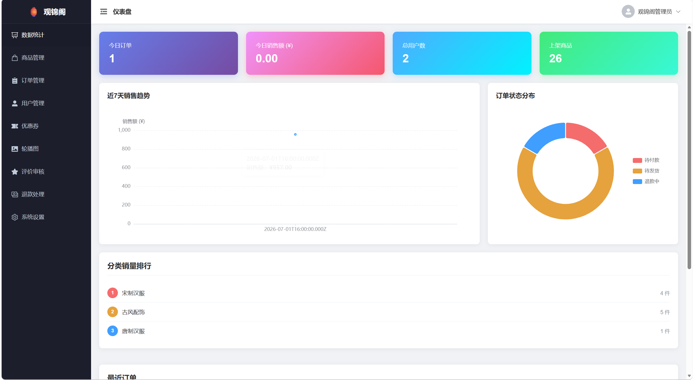
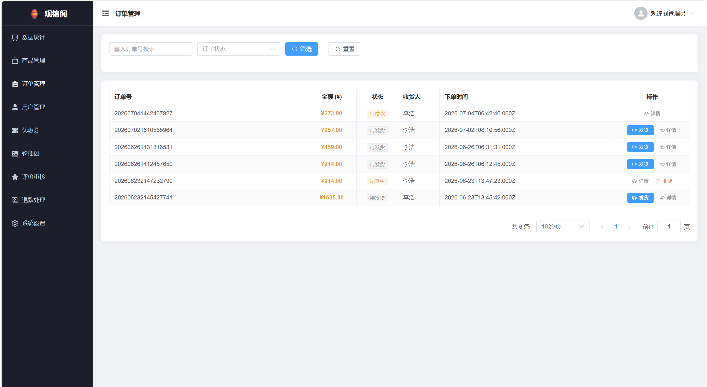

# 观锦阁 - 汉服电商平台

观锦阁是一个汉服主题的垂直电商平台，采用前后端分离架构。前端包含两套 Vue 3 SPA：前台商城提供首页推荐、多维度商品筛选、购物车、模拟支付、订单追踪等完整购物链路；后台管理系统提供 ECharts 数据仪表盘、商品管理、订单发货、优惠券与轮播图配置、评价审核等运营功能。后端基于 Node.js + Express，14 个路由模块覆盖全部业务，JWT 实现用户与管理员双 Token 认证。数据库采用 MySQL 8.0，设计 20 张数据表，涵盖 SPU/SKU 规格模型、订单流转、营销工具等完整电商场景。

## 功能展示

| | | |
|:---:|:---:|:---:|
|  |  |  |
|  |  |  |
|  |  |  |
|  |  |  |

## 技术栈

| 层级 | 技术 |
|------|------|
| 前端 | Vue 3 + Element Plus + Vue Router + Pinia + Axios + Vite |
| 后端 | Node.js + Express + JWT + Multer |
| 数据库 | MySQL 8.0 + 20张数据表 |
| 图表 | ECharts 5 |

## 项目结构

```
├── backend/                # Node.js 后端 (端口8090)
│   ├── routes/             # 14个API路由模块
│   ├── middleware/          # JWT认证中间件
│   └── public/             # 传统HTML静态页面
├── frontend-customer/      # Vue3 前台客户端 (端口5173)
├── frontend-admin/         # Vue3 后台管理系统 (端口5174)
└── mysql_init.sql          # 数据库初始化脚本
```
